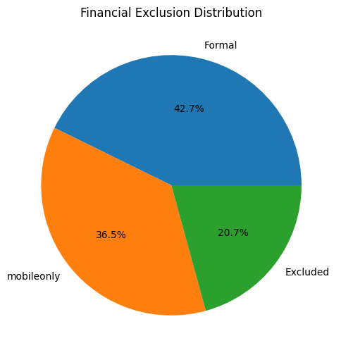

# Kenya-financial-inclusion-risk
Machine learning project using Kenya FinAccess data to predict, explain and map financial exclusion risk.
# Financial Exclusion EDA & Subgroup Analysis

## Project Overview

This noteook focuses on an **Exploratory Data Analysis (EDA)** of financial inclusion and exclusion data. The notebook explores demographic and geographic patterns affecting financial exclusion using subgroup analysis techniques.

The analysis investigates:

* County distribution of respondents
* Gender distribution
* Rural vs Urban representation
* Education levels
* Age group patterns
* Missing values within the dataset
* Relationships between demographic variables and financial exclusion
* County-level financial exclusion trends

The goal of this project is to identify key insights and patterns that can help understand which populations are more financially excluded and why.


# Dataset Information

The dataset contains demographic, geographic, and financial inclusion variables collected from survey respondents.

### Key Variables Explored

* County
* Gender
* Age
* Education Level
* Rural/Urban Classification
* Financial Exclusion Target Variable



### Objectives

The main objectives of this analysis are:

1. Perform exploratory data analysis on the dataset
2. Generate frequency tables for major demographic variables
3. Analyze missing values
4. Explore subgroup patterns in financial exclusion
5. Create visualizations to support findings
6. Identify vulnerable populations with higher exclusion rates
7. Compare financial exclusion across counties and demographic groups
8. Compare 2024 financial exclusion report vs 2021


# Tools and libraries Used
* Python
* Jupyter Notebook
* Pandas
* NumPy
* Matplotlib
* Seaborn
* Github and git bash


The notebook includes:

* Handling missing values
* Data inspection
* Frequency distribution analysis
* Variable transformation
* Cross-tabulation analysis


# Exploratory Data Analysis

## Frequency Tables

The notebook generates frequency distributions for:

* County
* Gender
* Rural vs Urban
* Age Groups
* Education Levels

These distributions help understand the composition of respondents in the dataset.


# Missing Values Analysis

The notebook identifies variables with missing data and visualizes columns with the highest percentages of missing values.

This step helps:

* Detect data quality issues
* Understand incomplete variables
* Guide preprocessing decisions


# Visualizations

Several visualizations are included to support analysis and interpretation:

### Demographic Visualizations

* Gender distribution count plots
* Rural vs Urban distribution plots
* Education level charts
* Age distribution charts

### Financial Exclusion Analysis

* Age vs Financial Exclusion
* County vs Financial Exclusion
* Rural vs Urban Financial Exclusion
* Financial Exclusion Rate by County
* Top 10 Counties with Highest Financial Exclusion
* Top 10 Counties with Lowest Financial Exclusion

### Comparative Analysis

* Residence by Gender
* Gender vs Target Variable
* Education vs Target Variable
* County vs Target Variable


# Cross-Tabulation Analysis

Cross-tabulation analysis was performed to examine relationships between:

* Gender and County
* Gender and Financial Exclusion
* County and Financial Exclusion
* Age and Financial Exclusion
* Education and Financial Exclusion
* Rural/Urban Status and Financial Exclusion

These analyses help identify which demographic groups are more vulnerable to financial exclusion.


# Key Insights

Some important findings from the analysis include:

* Financial exclusion varies significantly across counties.
* Rural populations tend to experience higher levels of financial exclusion compared to urban populations.
* Education level appears to influence financial inclusion.
* Certain age groups, especially youth populations, show notable exclusion patterns.
* Gender differences exist in access to financial services.


# Conclusions

The analysis highlights the importance of demographic and geographic factors in understanding financial exclusion.

Key conclusions:

* Rural communities remain more financially vulnerable.
* County-level disparities indicate unequal access to financial services.
* Education plays an important role in financial inclusion.
* Youth populations require targeted financial inclusion strategies.
* Data-driven interventions can help policymakers and organizations improve access to financial services.


# Recommendations

Based on the findings, the following recommendations can be considered:

1. Expand financial services in underserved rural regions.
2. Increase financial literacy programs.
3. Develop youth-focused financial inclusion initiatives.
4. Improve digital financial accessibility.
5. Conduct deeper predictive and statistical analysis.


# Future Improvements

Potential next steps for this project include:

* Building predictive machine learning models
* Creating interactive dashboards
* Performing clustering analysis
* Integrating additional socioeconomic variables


# How to Run the Notebook

## 1. Clone the Repository

```bash
git clone <repository-url>
cd <repository-folder>
```

## 2. Install Dependencies

```bash
pip install pandas numpy matplotlib seaborn notebook
```

## 3. Launch Jupyter Notebook

```bash
jupyter notebook
```

## 4. Open the Notebook

Open:

```bash
notebooks-03_eda_subgroup_analysis.ipynb
```

